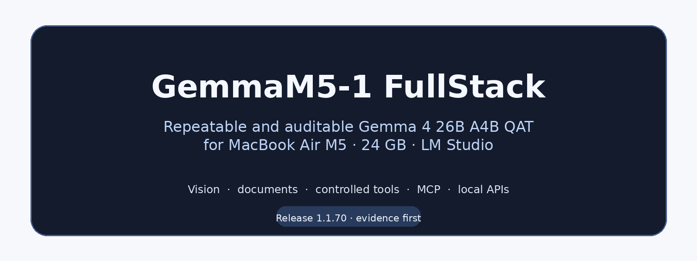
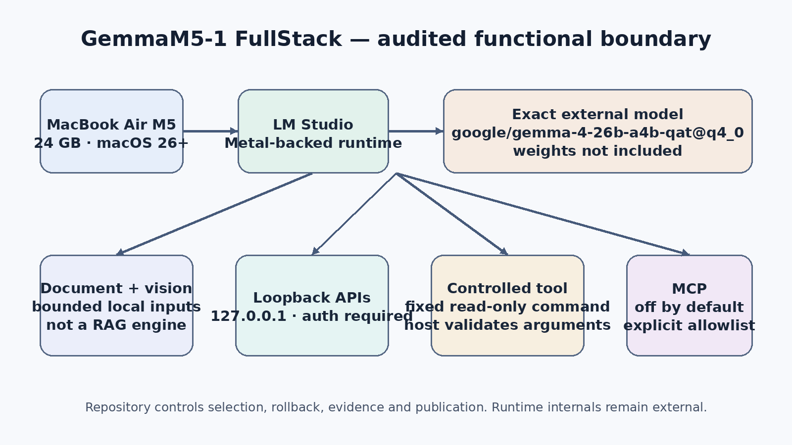
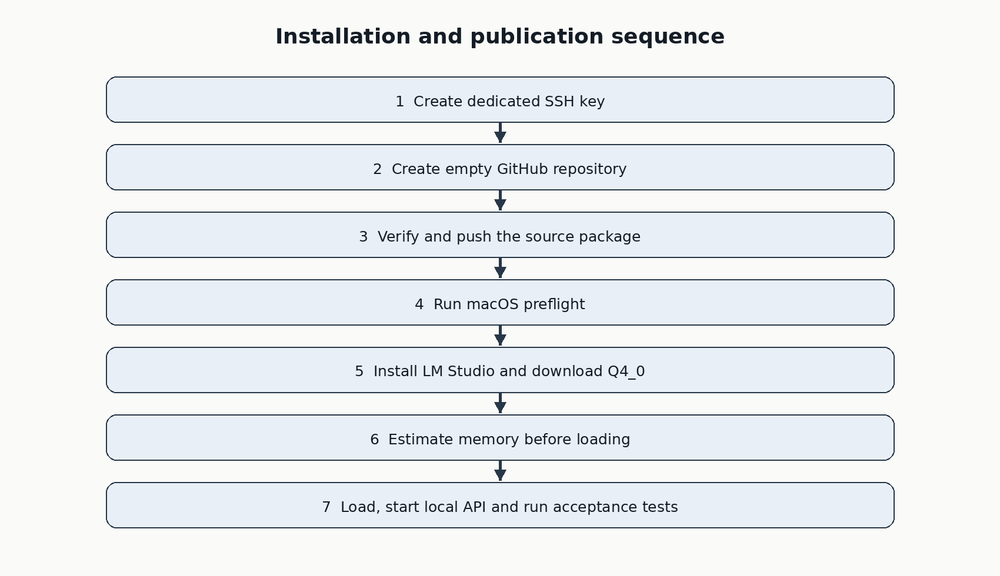
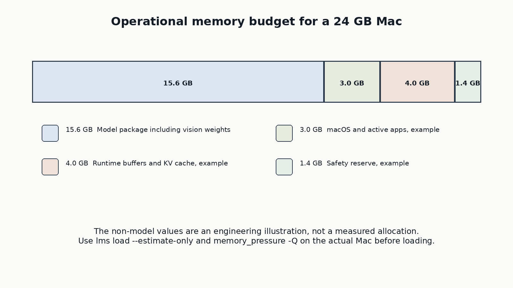

<p align="center">
  
</p>

<h1 align="center">GemmaM5-1 FullStack</h1>

<p align="center">
  <strong>Repeatable and auditable Gemma 4 26B A4B QAT deployment for a 24 GB MacBook Air M5</strong><br>
  Vision, reasoning, documents, controlled tools, MCP and local APIs through LM Studio.
</p>

<p align="center">
  <a href="https://github.com/Gendalf71/GemmaM5-1-FullStack/actions/workflows/ci.yml"></a>
  
  
  
  <a href="LICENSE"></a>
  
  
</p>

<p align="center">
  <a href="#quick-start">Quick start</a> ·
  <a href="docs/INSTALL_MODEL.md">Model installation</a> ·
  <a href="docs/INSTALL_GITHUB_SSH.md">GitHub over SSH</a> ·
  <a href="docs/VALIDATION.md">Validation</a> ·
  <a href="docs/ACCEPTANCE_CHECKLIST.md">Owner acceptance</a> ·
  <a href="docs/BENCHMARK_PROTOCOL.md">Benchmark protocol</a> ·
  <a href="docs/BACKEND_PORTABILITY.md">Backend boundary</a> ·
  <a href="docs/COMPATIBILITY.md">Compatibility</a> ·
  <a href="docs/FINAL_AUDIT.md">Final audit</a> ·
  <a href="docs/ASSURANCE_CASE.md">Assurance case</a> ·
  <a href="docs/MODEL_PROVENANCE.md">Model provenance</a> ·
  <a href="docs/RELEASE.md">Release</a> ·
  <a href="docs/THREAT_MODEL.md">Threat model</a> ·
  <a href="docs/GITHUB_METADATA.md">GitHub metadata</a> ·
  <a href="docs/SECURITY.md">Security</a> ·
  <a href="docs/ru/README.md">Русская документация</a>
</p>

**Current stable release:** `1.1.240`.

## Publication status

| Surface | Status | Meaning |
| --- | --- | --- |
| Repository structure, scripts and documentation | Verified | 91 bounded unit checks plus a 90 × 24 static control matrix |
| Release archive | Verified | Exact inventory, internal SHA-256 manifest, deterministic dual build and clean extraction |
| External source record | Verified as of 2026-07-24 | Exact URLs and immutable action commits are recorded; future reachability is not implied |
| MacBook Air M5 runtime performance | Pending owner acceptance | No fabricated throughput, thermal, memory-pressure or screenshot evidence |

This measured-versus-unmeasured boundary is deliberate. The current LM Studio system-requirements page names Apple Silicon generations through M4 rather than M5. This repository therefore does not treat that generic page as proof of M5 support. The target hardware identity and memory bounds come from Apple's M5 pages; actual LM Studio operation on the owner's M5 remains an owner-run acceptance item.

No model weights included. This repository is an installation, validation and publication kit. It does not implement a new inference engine and does not distribute model weights. Its purpose is to make a demanding local configuration explicit, reviewable and repeatable rather than to hide it behind a one-click script.

## Try it safely

The first command proves the repository; the second proves the target Mac profile; neither downloads weights or starts a server. The visual gate also rejects diagrams whose content enters the protected outer margin:

```bash
./scripts/verify_repo.sh
./scripts/preflight.sh
```

Then inspect the exact external package and estimate the intended 8K operating point before any load:

```bash
./scripts/download_model.sh
./scripts/estimate_model.sh 8192
```

No command in this path silently publishes to GitHub, exposes the API beyond loopback, unloads unrelated models or executes a model-proposed shell string. After the server is running, `make fullstack` performs one bounded local document + image request followed by the fixed read-only memory-pressure tool; it is an acceptance example, not a general RAG engine. `make hardware-report` creates an ignored owner-only evidence file for review.

## What this repository is — and is not

| It is | It is not | Proof boundary |
| --- | --- | --- |
| A target-specific deployment and assurance kit | A new inference engine or a fork of LM Studio | Static checks cover repository behavior; LM Studio internals remain external |
| A guarded profile for one exact QAT/Q4_0 catalog identity | A bundle of model weights | Model provenance is captured after local download |
| A publication workflow for `Gendalf71/GemmaM5-1-FullStack` | An automatic claim of M5 performance | Performance remains `not_measured` until owner-run acceptance |


The target model is the instruction-tuned `google/gemma-4-26b-a4b-qat` catalog entry in GGUF `Q4_0`. Gemma 4 26B A4B is a mixture-of-experts model with approximately 25.2 billion total parameters and about 3.8 billion active parameters per token. The official LM Studio catalog lists the selected Q4_0 package at 15.60 GB (about 14.53 GiB). Download size, on-disk allocation and resident unified-memory use are different quantities; the exact footprint still varies with catalog revision, context, runtime buffers and vision use. A 24 GB Mac therefore requires a conservative context, one active prediction and a measured memory reserve. The automated preflight is intentionally target-specific: it requires `MacBook Air`, model identifier `Mac17,3` or `Mac17,4`, an `M5` chip token, arm64, at least 24 GiB reported memory and macOS 26.0 or newer.

> [!IMPORTANT]
> This repository has passed static verification. It does **not** claim a completed MacBook Air M5 benchmark. The final acceptance test must be run on the target computer. Results depend on the exact Mac, macOS and LM Studio runtime versions, background applications, context length and thermal conditions. Contexts of 32K and above are experimental for this profile.

## At a glance

| Item | Operational value |
| --- | --- |
| Target computer | MacBook Air M5, model `Mac17,3` or `Mac17,4`, 24 GB profile; Apple lists 153 GB/s memory bandwidth |
| Model | Gemma 4 26B A4B IT QAT |
| Architecture | MoE, ~25.2B total / ~3.8B active per token |
| Local package | LM Studio catalog, GGUF `Q4_0`; 15.60 GB in the catalog (about 14.53 GiB), before runtime/context overhead |
| Initial context | 8,192 tokens |
| GPU offload | Maximum, subject to estimator output |
| Concurrent predictions | 1, enforced by `lms load --parallel 1` |
| Local identifier | `gemma4-local` |
| API bind | `127.0.0.1:1234` |
| Static status | Repository and release gates verified |
| Hardware status | Performance acceptance still required on the physical target Mac |

## Reproducibility boundary and model provenance

The repository release itself is deterministic and checksum-verified. The external model package is intentionally **not** described as byte-for-byte reproducible: `google/gemma-4-26b-a4b-qat` is a revisioned LM Studio catalog entry whose upstream files may be corrected or replaced without changing this repository. This kit therefore guarantees a repeatable configuration profile, exact `Q4_0` selection, explicit runtime settings and an auditable local record—not an immutable copy of third-party weights.

After downloading the model on the target Mac, capture the verified `ModelInfo.path`/`modelKey` pair and a privacy-filtered machine-readable inventory. The raw local path is not published; only its SHA-256 digest is recorded:

```bash
make provenance
cat artifacts/model-provenance.json
```

The report excludes local model paths and is ignored by Git. Review it before publishing it as hardware evidence. See [Model provenance](docs/MODEL_PROVENANCE.md). The primary-source claim ledger used by the static audit is [versioned and machine-readable](docs/audit/external-evidence-1.1.240.json). High-risk source identities (Apple M5 pages, LM Studio paths and GitHub Action release commits) are checked exactly; offline gates do not pretend to prove future URL reachability.

## Capability boundary

The project deliberately separates model capabilities from runtime features.

| Function | Supplied by | Boundary |
| --- | --- | --- |
| Text, code, system prompts | Gemma 4 + LM Studio | Text output only |
| Image understanding | Gemma 4 vision path | Images may be interleaved with text |
| Reasoning mode | Model card and LM Studio preset | Thinking must be enabled in model settings |
| Documents and RAG | LM Studio application | This repository supplies bounded document acceptance, not a retrieval engine; scanned PDFs may require OCR outside it |
| Tool calling | Model proposes; host validates and executes | No model-provided shell command is executed |
| MCP | LM Studio native API | Disabled by default; explicit permissions and allowlists required |
| OpenAI-compatible API | LM Studio | Localhost only in project scripts |

Gemma 4 26B A4B accepts text and images and produces text. Audio is not part of this model profile. The architecture supports up to 256K tokens, but the local operating point begins at 8K and is increased only after an estimate and a stability test.

## Architecture

<p align="center">
  
</p>

GemmaM5-1 FullStack uses LM Studio and its Metal-backed runtime as the execution layer. The repository surrounds that runtime with deterministic model selection, memory gates, API examples, a constrained tool loop, MCP guidance, static checks and SSH publication instructions.

## Quick start

Run all commands from the repository root.

```bash
chmod +x scripts/*.sh scripts/*.py examples/*.sh examples/*.py
./scripts/verify_repo.sh
./scripts/preflight.sh
```

Install or update LM Studio through an existing Homebrew installation:

```bash
./scripts/install_lm_studio.sh
```

Launch LM Studio once, then verify its CLI:

```bash
lms --help
```

Download the exact catalog entry and quantization:

```bash
./scripts/download_model.sh
python3 scripts/resolve_model_identity.py --format json
```

The target catalog ID and Q4_0 quantization are fixed for this 24 GB profile and are rejected before download if locally changed. The default download path never falls back to a manual catalog choice. After download, the resolver consumes only machine-readable `lms ls --json`, requires exactly one local QAT/GGUF/Q4_0 identity whose `modelKey` belongs exactly to `google/gemma-4-26b-a4b-qat`, and returns its `ModelInfo.path` and variant-qualified `modelKey` as a verified pair. Lookalike publisher/name pairs are rejected. This distinction is mandatory because current `lms load --exact` matches the positional argument against `ModelInfo.path`; `modelKey` is retained as an independent loaded-instance postcondition. If an exact catalog download fails, review the error first; use `--interactive-fallback` only for a deliberate Q4_0 selection that will still be verified afterwards.

Estimate memory before loading:

```bash
./scripts/estimate_model.sh 8192
```

Review the estimate. Then load the model. The script requires LM Studio 0.4.11 or newer (0.4.20 or newer recommended), verifies the CLI contract, passes the exact local `ModelInfo.path` to `lms load --exact`, and independently verifies the resulting `modelKey`, identifier and single-prediction setting. An already-loaded instance is accepted only when all four fields match uniquely; conflicts are rejected before loading, and a failed partial load is rolled back by the exact managed identifier:

```bash
./scripts/load_model.sh --execute --context 8192
```

When other models must be removed first, request that action explicitly. The script asks for confirmation before running `lms unload --all`:

```bash
./scripts/load_model.sh --execute --context 8192 --unload-others
```

Before starting the API, open LM Studio **Developer > Server Settings**, enable **Require Authentication**, create a least-privilege API token and load it into the current Terminal without placing it in shell history:

```bash
read -s LM_API_TOKEN
export LM_API_TOKEN
printf '\n'
```

Start the API and run acceptance tests in a second Terminal window that has the same `LM_API_TOKEN`. Startup is accepted only when LM Studio reports `running=true` on the configured port, **every** endpoint reported by `lsof` is numeric loopback, unauthenticated `/v1/models` access is rejected and token-authenticated access succeeds:

```bash
./scripts/start_server.sh
python3 tests/api_smoke_test.py --model gemma4-local
```

The text, vision, tool and smoke-test clients reject non-loopback API base URLs by default before reading or sending prompts, images or `LM_API_TOKEN`. Shell clients pass tokens through owner-only temporary header files rather than command-line arguments visible to process inspection. Remote delivery requires the explicit `--allow-remote-base-url` flag and an HTTPS endpoint.

Capture the target environment for an auditable local report:

```bash
mkdir -p artifacts
./scripts/collect_environment.sh > artifacts/hardware-environment.txt
```

The `artifacts/` directory is ignored by Git so machine-specific paths and inventory cannot enter a commit accidentally. Review and redact any report before publishing it separately.

Stop the server when finished:

```bash
./scripts/stop_server.sh
```

Shutdown is accepted only after LM Studio reports `running=false` and `lsof` confirms that no listener remains on the configured port.

## End-to-end sequence

<p align="center">
  
</p>

The publication path and the hardware-acceptance path are intentionally separated: a repository can be structurally correct before the physical Mac has produced its first measured result.

## Configuration

Defaults are stored in `config/defaults.conf`. To override them without modifying tracked defaults:

```bash
cp config/defaults.conf config/local.conf
```

The parser accepts only a fixed key allowlist and never evaluates the configuration as shell code.

```text
MODEL_CATALOG_ID=google/gemma-4-26b-a4b-qat
MODEL_QUANTIZATION=q4_0
MODEL_IDENTIFIER=gemma4-local
CONTEXT_LENGTH=8192
GPU_OFFLOAD=max
MAX_CONCURRENT_PREDICTIONS=1
TTL_SECONDS=3600
SERVER_HOST=127.0.0.1
SERVER_PORT=1234
REQUIRE_API_AUTH=1
TARGET_MODEL_NAME=MacBook Air
TARGET_CHIP_TOKEN=M5
MIN_MACOS_VERSION=26.0
```

## Memory discipline

<p align="center">
  
</p>

The diagram is an engineering illustration, not a measured allocation. The operational rule is:

```text
Estimate first
Load one model
Run one prediction at a time
Increase context in measured steps
Return to 8192 at persistent swap or non-green memory pressure
```

Use both commands on the actual Mac:

```bash
lms load MODEL_PATH --estimate-only --exact --local --context-length 8192 --gpu max
memory_pressure -Q
```

A successful 8K load does not imply that 32K, 128K or 256K will remain stable.

## Measured evidence and screenshots

Version 1.1.240 deliberately contains no claimed M5 benchmark and no simulated LM Studio interface screenshot. Canonical benchmark records and runtime screenshots may be added only by the repository owner after direct acceptance on the target MacBook Air M5. Every published image must be redacted, dated and tied to the recorded LM Studio, runtime, model key and context. See [Screenshot evidence policy](docs/SCREENSHOTS.md) and [Hardware acceptance results](benchmarks/README.md).

## Safe tools and MCP

`examples/safe_tool_call.py` exposes one read-only function. The model can request `read_memory_pressure`; the host verifies the function name, rejects arguments and executes only the fixed command `/usr/bin/memory_pressure -Q`.

MCP examples remain opt-in. `config/mcp_request.example.json` restricts the remote server to one public search tool. The executable example validates the allowlist, applies `MODEL_IDENTIFIER` to a temporary payload instead of modifying the tracked template, and refuses to send the request or `LM_API_TOKEN` beyond a numeric loopback address unless `--allow-remote-base-url` is supplied explicitly:

```bash
MODEL_IDENTIFIER=gemma4-local ./examples/mcp_request.sh
```

Review `docs/MCP_SAFE_PATTERNS.md` before enabling any filesystem, browser, email or command-execution integration. A remote native API endpoint is a separate trust decision because both request content and the optional LM Studio bearer token leave the local machine.

## Repository quality gates

```bash
make verify
```

`make verify` also validates the canonical benchmark record as explicitly unmeasured until owner evidence exists. Static checks cover Bash and Python syntax, JSON validity, canonical checksum-manifest structure, fail-closed target-profile validation, exact Q4_0 path/modelKey identity resolution, local Markdown links, version consistency, safe network defaults, expected GitHub SSH identity checks, absence of private keys and absence of model weights.

Build and re-verify a release archive:

```bash
make package
```

For the first Git commit, use `scripts/stage_release_files.sh` rather than `git add .`. It stages only the checksum-manifest inventory and rejects unexpected untracked files before anything can be committed. After a commit exists, `scripts/verify_git_inventory.sh --require-clean` proves that the complete tracked tree still equals `SHA256SUMS` plus the manifest itself; this closes the separate risk of a clean but over-inclusive prior commit.

The builder copies only files listed in `SHA256SUMS`, writes a deterministic ZIP with fixed metadata and compressor-independent stored entries, confirms byte-for-byte reproducibility, preserves executable modes, extracts it with the system `unzip`, reruns static verification and writes a sidecar SHA-256 file. `scripts/create_github_release.sh` then requires the clean manifest-exact commit to equal `origin/main`, requires successful CI for that exact SHA and verifies tag targets before creating a Release. See [Release procedure](docs/RELEASE.md).

On the target Mac, run the complete preparation chain:

```bash
make all
```

`make all` performs repository verification, hardware preflight and an 8K resource estimate. It intentionally fails on non-macOS hosts or before the model is downloaded.

## Repository map

| Path | Purpose |
| --- | --- |
| `scripts/` | Fail-closed preflight, exact model resolution, lifecycle, publication and release gates |
| `config/` | Fixed target profile plus ignored local token/config overlay |
| `examples/` | Local API, vision, constrained tool and MCP examples |
| `docs/` and `docs/ru/` | English and Russian operational monograph |
| `docs/audit/` | Versioned control matrix, source ledger and revision evidence |
| `benchmarks/` | Schema and owner-fillable target-Mac acceptance record |
| `tests/` | Functional negative and positive repository checks |

## Documentation

English primary documentation:

- [Install the model](docs/INSTALL_MODEL.md)
- [Publish to GitHub through SSH](docs/INSTALL_GITHUB_SSH.md)
- [Architecture](docs/ARCHITECTURE.md)
- [Security](docs/SECURITY.md)
- [Validation](docs/VALIDATION.md)
- [Runtime compatibility contract](docs/COMPATIBILITY.md)
- [Final independent audit](docs/FINAL_AUDIT.md)
- [Model provenance](docs/MODEL_PROVENANCE.md)
- [Release procedure](docs/RELEASE.md)
- [Screenshot evidence policy](docs/SCREENSHOTS.md)
- [Troubleshooting](docs/TROUBLESHOOTING.md)
- [Safe MCP patterns](docs/MCP_SAFE_PATTERNS.md)
- [Review cycles](docs/CRITIQUE_LOG.md)
- [TurboFieldfare structural comparison](docs/TURBO_FIELDFARE_COMPARISON.md)
- [Русский итоговый аудит](docs/ru/FINAL_AUDIT.md)
- [Русское структурное сравнение с TurboFieldfare](docs/ru/TURBO_FIELDFARE_COMPARISON.md)
- [Primary references](docs/REFERENCES.md)

Russian documentation is collected under [`docs/ru/`](docs/ru/README.md).

## Relationship to TurboFieldfare

[TurboFieldfare](https://github.com/drumih/turbo-fieldfare) is a model-specific Swift and Metal runtime that keeps a small resident core and streams routed experts from SSD. Its public scope is text-only inference and it explicitly excludes image input and tool calling.

GemmaM5-1 FullStack keeps the standard LM Studio runtime and accepts a larger resident-memory budget to preserve vision, reasoning, document workflows, controlled tool calling, MCP and standard APIs. The projects address different optimization objectives and can be read as complementary engineering studies.

## License boundary

Repository code and documentation are released under the MIT License. The model is not bundled. Google lists Gemma 4 under Apache 2.0; LM Studio, Homebrew, GitHub Actions and any MCP server retain their own terms and security boundaries.

Server startup is transactional: it refuses to take over a pre-existing LM Studio server, and if listener or authentication postconditions fail after startup, it attempts to stop the server it started before returning an error.
